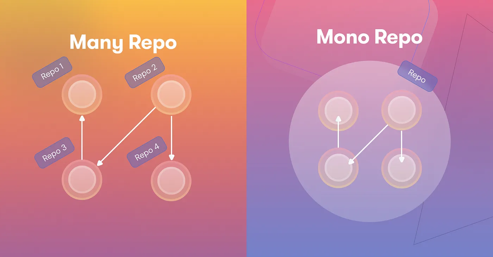

When I first encountered the concept of a **MonoRepo**, it didn't quite make sense. 🤔 Why would anyone put all their code into a single repository? In my experience, each microservice had its own dedicated repository, built separately to reduce complexity. Combining everything into one place seemed like it would only increase developer effort and make things more confusing — until I came across this fascinating case study by Google. 

---

## 💡 Advantages and Disadvantages of a Monolithic Repository

A **MonoRepo** (Monolithic Source Code Repository) is a way to store many projects in one repository. These projects can be related or completely distinct.

One question that might cross your mind is: **"If these projects can run independently, why put them in one place?"** 🤷‍♂️ The answer is what the case study explored. Here are the key advantages discussed:

### 🚀 **Improved Code Re-usability and Sharing**
With access to the complete codebase, developers could search for examples of using particular endpoints/modules, which **significantly boosted productivity**. 🛠️

### 🔧 **Simplified Dependency Management**
With all projects in one place, managing shared dependencies became easier. Instead of updating libraries and tools across multiple repos, it only needed to be done once. However, this also became a challenge as all services needed to **agree on specific versions of libraries and tools**. ⚠️

### 🧑‍💻 **Improved Code Quality**
Developers naturally adopted **best practices** from well-written code within the MonoRepo, resulting in cleaner, more efficient, and consistent code across the entire codebase.

---

## 🧐 The Gray Areas: Pros & Cons

While these are clear advantages, there are also some gray areas that can spark debate among developers. Experiences can vary:

### ⏳ **Build Time**
- For the **entire project**, build time can be reduced. ⏩
- However, for **small changes** in specific microservices, the build time can increase significantly. 🐢

### ⚡ **Development Velocity**
- Some teams experience a **boost in velocity** due to easier collaboration, unified processes, and better code reuse. 🔥
- On the flip side, as the MonoRepo grows, challenges like **frequent merge conflicts**, higher cognitive load, and the need for advanced tooling can slow things down. 🧠💥

---

## 🧩 Features Developers Miss in MonoRepos

Despite the benefits, some key features are missed:

### 🛠️ **Flexibility**
In a **MultiRepo** system, developers had the freedom to choose from various libraries and tools. As they move to MonoRepo, these options become limited, causing some friction. 🛑

### 🔒 **Access Control**
Managing **access control** in a MonoRepo can be challenging. Defining ownership and permissions at the folder level is cumbersome, even if merges require approval from code owners.

---

## 🏁 **Conclusion**

After reading this case study, my perspective on MonoRepos has shifted significantly. What once seemed like a less favorable approach now appears much more promising.

### ✅ **When to Use a MonoRepo**:
- **Less Frequent Code Changes**
- **Interdependent Microservices**
- **Focus on Overall Code Quality**

### ❌ **When Not to Use a MonoRepo**:
- **Frequent Code Changes**
- **Independent or Minimally Dependent Microservices**

---

I hope this article has provided valuable insights into MonoRepos and contributes to your growth as a better engineer. 🖥️💡

[Download PDF](../assets/papers/Misc/Advantage-and-Disadvantages-of-a-Monolithic-Repository.pdf)
